<a id="top"></a>
# Creating, hosting, and publishing Leaflet maps with qgis2web and GitHub
## Contents
1. [Getting Started](#start)
2. [A gentle introduction to GitHub](#introGit)
3. [Working with QGIS](#qgis)
4. [Editing qgis2web index.html file](#index)
5. [Push changes to GitHub](#push)
6. [Integrating with a website](#web)
7. [Bonus materials on image processing](#bonus)
<a id="start"></a>
## Getting started

### About
This workshop provides a foundation for getting started with creating, configuring, and hosting web maps with the QGIS plugin QGIS2Web and GitHub. It is not meant to give a comprehensive introduction to all applications used, such as QGIS, Leaflet, and Atom. Familiarity with editing html documents in a text editor and some foundational experience with geospatial data, GIS, and GitHub may be helpful if following along.

This workshop will not cover how to create the geospatial data or host images in web maps. However, some bonus sections at the bottom of this document contains basic information about image processing.

### Why use [Leaflet](https://leafletjs.com/)?
Using a free and open-source tool that gives access to source code ensures that you retain access and ownership of the code and data. Many content management system plugins, web map creation platforms (Esri, Carto), and/or freemium services may not allow you to fully retain ownership, often have data limits and restrictions, can use your map and data in any way per any license agreement, can make it difficult to extract the source code and data, may change pricing structures at any time, or delete your data without notice.

You can choose to host a Leaflet map on any platform, but this tutorial uses GitHub. GitHub is free and easy to use for sharing code, working on digital projects, and hosting html documents and images, which this tutorial makes use of.

### Software and accounts
This tutorial was made using Mac iOS Mojave v 10.14.5. The following software and accounts are used and are required **before** going further:

- [GitHub account](https://github.com/)
- [QGIS3](https://qgis.org/en/site/forusers/download.html)--3.4.7-Madeira used, [video for Mac install assistance](https://www.youtube.com/watch?v=908NyL7roFs)
- [GitHub Desktop](https://desktop.github.com/)
- [Atom text editor](https://atom.io/)--version 1.37.0 used
- [Firefox](https://www.mozilla.org/en-US/firefox/new/) and/or [Chrome](https://www.google.com/chrome/) web browsers--I like viewing and testing the map in multiple browsers
<a id="introGit"></a>
## A gentle introduction to GitHub
This tutorial uses git and GitHub mostly through the desktop and the online interface rather than the command line. All steps for creating new repositories, publishing, and pushing changes are possible in Terminal or a command line tool, too, and are recommended to use over the Desktop app. See the [GitHub Cheat Sheet](https://education.github.com/git-cheat-sheet-education.pdf) for the commands.

### Fork this repository and clone to GitHub Desktop
1. Go to [github.com](https://github.com/) and login. Create a new account if needed.

2. Go the repository for this workshop: [github.com/taylorhixson/WF](https://github.com/taylorhixson/WF)

3. In the top right of the repository, click **Fork**.

  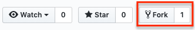

4. Once the repository is forked, it will show up in your repositories. If needed click your profile avatar in the top right and choose **Your repositories**. If the repository was forked correctly, a repository called **WF** should appear.

5. In the **WF** repository, click **Clone or download**, and from that popup, choose **Open in Desktop**. Make sure the link shows your GitHub username **NOT** the workshop creator's username. The below screenshot shows the creator's because the screenshot was taken from her account.

  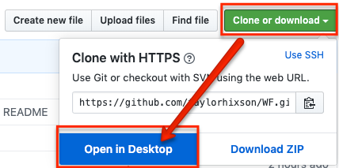

  If the browser prompts you, choose **Open GitHub Desktop**.

  

6. Navigate to where you save git repositories. If this is your first one or you don't have a primary git folder, just use the default.

### Create gh-pages
1. Once the repository is cloned, click **Current Branch**, which is between Current Repository and Push origin. The current branch probably says master.

  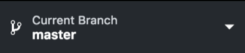

2. Click **New Branch**.

  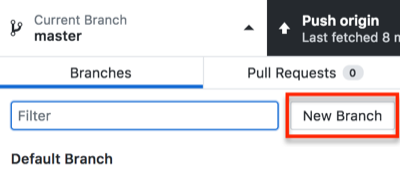

3. Name the new branch **gh-pages**. The branch **must** be named gh-pages. Naming a branch gh-pages tells GitHub that the branch should function as [GitHub Pages](https://help.github.com/en/articles/what-is-github-pages), GitHub's hosting services.

  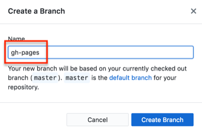

4. Click **Create Branch**.

5. Click **Publish branch**.

6. Once you publish something to the gh-pages branch, you can see it at the branch's GitHub Pages site at YourGitHubAccount.github.io/gitRepositoryName/webapp.
  - YourGitHubAccount = replace with your GitHub account named
  - .github.io/ = keep as is
  - gitRepositoryName = input the git repository name such as 2019_oslo
  - webapp = this is the where an index.html file or something to display online lives. In this workshop it is the folder that originally had the long qgis2web title and was changed to webapp in the section **Editing qgis2web index.html file**
  - For example a gh-pages link would like [taylorhixson.github.io/WF/webapp](https://taylorhixson.github.io/WF/webapp/#1/0/-4)
<a id="qgis"></a>
## Working with QGIS
**Note**: If downloading QGIS3 for the first time on a Mac, [watch this video](https://www.youtube.com/watch?v=908NyL7roFs). It is not a one-click install on Mac.

### Saving a project

1. Open QGIS. If you do not know where it is, search for it in Spotlight. The icon is a green Q.

2. Once open, use command + S, click the floppy disc icon in the top left of QGIS, **OR** click File>Save.

3. Navigate to the git repository for this project.

4. Name the QGIS project file.

5. Make sure the file type is **.qgz**.

    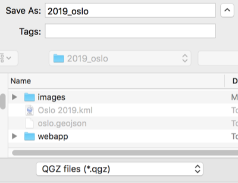

6. While working in QGIS, periodically save the project. Saving the project makes sure layer styles and all other project properties, including qgis2web Leaflet properties, are saved when the project is closed or when it is shared with others.

### Installing QGIS Plugins
1. Open QGIS.

2. Click **Plugins** from the top menu.

      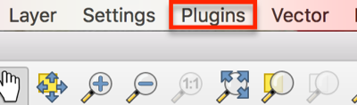

3. Click **Manage and Install Plugins...**.

      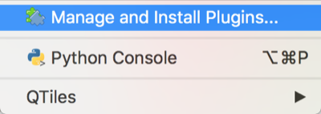

4. Make sure **All** is selected from the left side of the popup window, and in the search box, type **qgis2web**. **Note**: an internet connection is required to search for and install plugins this way.

      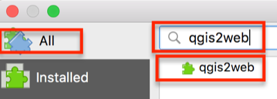

5. Select the result **qgis2web** so that the information about the plugin appears on the right side of the window.

6. Below the plugin description, click **Install plugin**.

      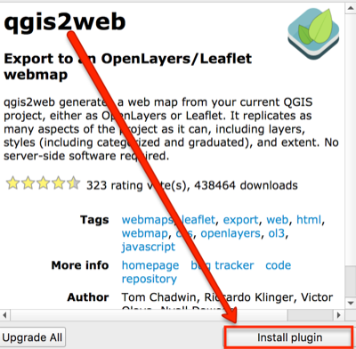

7. In the search results, make sure the box next to it is checked so that it appears.

      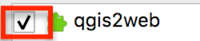

8. Search for **QuickMapServices**, and click **Install Plugin**. Make sure the box next to it is checked, too. For future reference, [open GIS Lab has a tutorial](https://opengislab.com/blog/2018/4/15/add-basemaps-in-qgis-30) and more information about configuring QuickMapServices and accessing more basemap options than the default.

      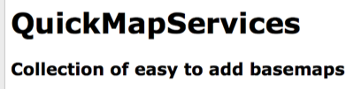

8. When both plugins are installed, close the plugins window. Not sure if they are installed? Click the **Installed** tab in the Plugins window.

9. From the **top menu**, click **Web**. Qgis2Web and QuickMapServices should both appear there. If not, quit QGIS and reopen the project. If it still does not appear, go back to the manage and install plugins window and check that these are listed in Installed Plugins. If the plugins are listed there, make sure the box to the left of the plugin is checked.

      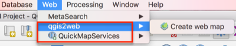

### Adding tabular data to QGIS

1. From the top menu, click Layer>Add Layer>Add Delimted Text data.

      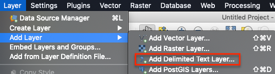

2. Click the three dots to the far right of File Name to navigate to the CSV used in this workshop.

3. Under **Geometry Definitions** make sure **Point coordinates** is selected.

4. Still in the Geometry Definition box, click the globe button to the far right of **Geometry CRS**.

    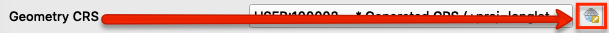

5. In the Filter search bar type `EPSG:4326`. The coordinate system, or CRS, used needs to correspond with the coordinates in the CSV. The coordinates are in the geographic coordinate system WGS 1984 format.

6. Once found, highlight it, and click OK.

7. All other system defaults or detected attributes should be OK, so click **Add**. Then, click **Close** as there are no other files to add from a delimited text source.

8. The points should appear in the main workspace, and the CSV should appear in the Layers panel.

    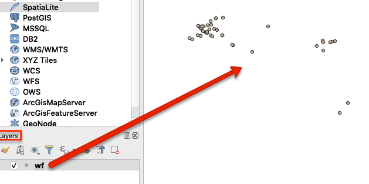

### Create Projected GeoJSON
Now, the data in the CSV needs to be **reprojected** to match the OpenStreetMap projection--a projected coordinate system.

1. Open the **Processing Toolbox** panel. Do this by clicking the gear icon, **or** from the top menu, **View>Panels>Processing Toolbox**.

2. Search for **reproject**, and double click **Reproject layer** under Vector general.

    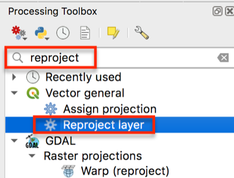

3. For the **parameters** in the window that appears:
  - **Input layer** should be the CSV. Search for it if necessary.
  - The **Target CRS is EPSG:3857**. If it is not in the dropdown, click the **globe icon** and **search for 3857**. This projection appears under Projected Coordinate Systems>Mercator>WGS 84 / Pseudo-Mercator, Authority ID EPSG:3857.
  - For **Reprojected**, click the **three dots**, and choose **Save to File**. Navigate to where you want the file saved. This should be somewhere in the git repository.
  - In the Navigator window, change the output file type to **.geojson**, give it a name, and choose the **Git repository** for this project as the **file directory path** to save the output.

    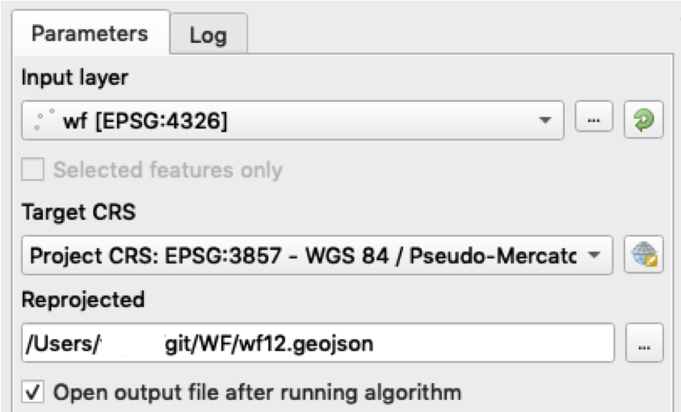

4. When the screen looks like the above image, click **Run** in the bottom right of the Reproject Layer window.

5. Close the Reproject Layer window when the Log tab shows the layer was reprojected successfully by displaying the message **"Algorithm 'Reproject Layer' finished"**

6. **Remove all layers** from the Layers panel by right clicking the layer and choosing Remove Layer, highlighting layers and clicking the Remove icon in the Layers panel, **OR** pressing `command + D` on the keyboard.

  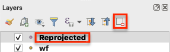

7. Add the reprojected layer by dragging it into the Layers panel. The layer **should** be in the git repository--if it is not, move it there before placing in the layers panel. This is the only item that should appear in the Layers panel! Additionally, make sure you can see the points in the QGIS workspace area.

  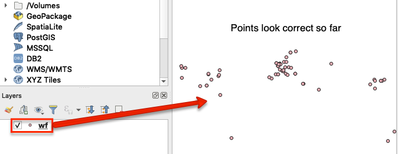

8. In the **Layers Panel** double click the wf geojson layer to open the **Layer Properties window**. Click the **Information** tab to make sure next to **CRS** is **EPSG:3857**. If it is close the window.

9. Double check the project CRS by looking in the bottom right of QGIS. It should show EPSG:3857. If it does not click whatever EPSG code is there, and search for 3857 in the pop up, select it, and click OK.

  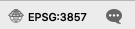

10. From the top-level toolbar, click Web > QuickMapServices > OpenStreetMap > OSMStandard.

  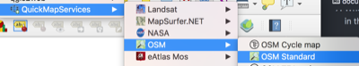

11. Do the places look correct on top of the OpenStreetMap basemap?

  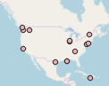

### Edit the data
Now that a spatial data file (GeoJSON) was created, there is no need for the latitude and longitude field. It is optional to either keep or delete these for aesthetic purposes.

1. Make sure QGIS is open and the reprojected geojson is in the Layers Panel.

2. Right click the layer in the Layers panel, and choose open attribute table.

    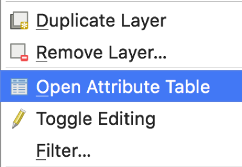

3. To edit the attribute table, click the pencil icon in the top left of the attribute table or use Command + E (Mac).

    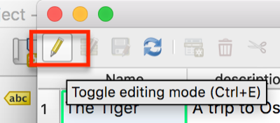

4. To start deleting empty columns, click the **Delete field icon**, highlighted in the image below. This icon appears when editing mode is turned on.
**Note**: Deleting a column is permanent. You may want to copy the geojson if this is your first time just in case.

  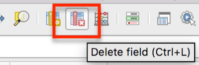

5. In the window that appears, click the following columns to select the Latitude and Longitude columns in order to delete them.

      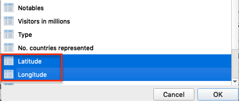

6. Once all the necessary columns are highlighted, click OK.

7. If the correct columns were deleted, click the floppy disc icon in the top left to save edits, or press `Ctrl + S` on the keyboard.

    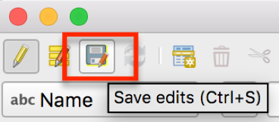

8. While in the attribute table, make any other content edits.

9. Click the pencil icon in the top left again when finished. Make sure to save edits.

### Styling the map
You may wish to style the points or categorize the data on the map. This tutorial will not go in depth to discuss layer styling. If you have never styled or categorized vector data in QGIS before or need a refresher, QGIS Tutorials has a good [Vector Styling tutorial](https://www.qgistutorials.com/en/docs/basic_vector_styling.html).

Alternatively, you can also leave the default point marker and change it to a leaflet style, which is demonstrated in a later step.

1. Double click the points layer with the World's Fair locations, shown here as wf.

2. In the Layer Properties window that appears, click the **Symbology** tab.

3. From the dropdown at the top of the screen choose Categorized.

4. Click the Column dropdown to choose a categorical feature to style the points. In this dataset, choose Type.

5. Near the bottom of the window, click **Classify**.

6. Highlight the line with the point that appears without any values.

7. At the bottom, click the minus sign.

8. Double click the points under Symbol to style them. Choose new colors or symbols.

9. Close the Layer Properties window when happy with the styles.

### Using qgis2web to export Leaflet code
The point of using qgis2web instead of immediately starting with Leaflet is that qgis2web can output complex and correct javascript for pop-ups, legends, and other map options without needing to know the code. Then, it is very simple to go into qgis2web's file outputs to make customizations and additions for basemaps, markers, more places, etc.

1. From the top toolbar in QGIS, click **Web>qgis2web>Create web map**.

  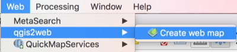

2. In the bottom left of the window that appears, click the radio button for **Leaflet**, and if needed, click **Update preview**.

  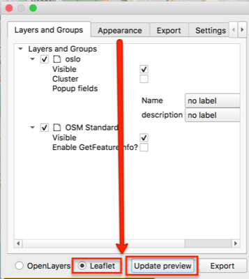

3. Make sure the map appears in the right side of the Export to web map window. If nothing appears or only one layer appears, there are two simple possibilities: 1) Leaflet is not selected or 2) the projection is probably incorrect--return to the Create Projected GeoJSON section.

  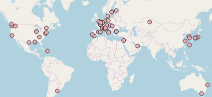

4. Under **Layers and Groups**, change the **Popup fields dropdowns**. I prefer to use **header label**, but the other options are inline label and None. **None** means the field **will appear** but without a label.

  

5. Click the **Appearance tab**, from the **Add layers list** dropdown choose one of the options. Choosing **collapsed** or **expanded** will **add a legend** to the map.

  

6. Make any other desired appearance changes. For example, and a **layer search and/or address search** to make the map more **web accessible**, measure tool, or have a custom map extent (how far someone can zoom in, out, and around). Click Update preview to see how any changes will look.

7. Click the **Export tab**.

8. Under Data export and to the right of Exporter, click the **three dots at the end of the line** to make sure the **output** goes to the **git repository folder**.

  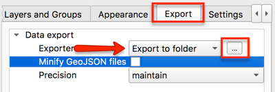

9. In the window that appears, **navigate** to the project's git repository and choose **Open**.

10. In the Export to web map window in QGIS, click **Export** at the bottom of the window.

  

11. When the map successfully exported, click OK. The log will show **Success** and the export file path if it is successful.
<a id="index"></a>
## Editing qgis2web index.html file
1. Navigate to the qgis2web folder in the git repository.

2. **Rename** the very long qgis2web folder name to **webapp**. This rename will be important for creating GitHub Pages at a later step. It is not necessary to use webapp specifically, but name it something short and memorable.

3. Open the folder, which is now named **webapp** in this tutorial, and double click the **index.html** file. The map will open in the default web browser. If for some reason the map is not appearing, right click the file and select Open with to open it with another web browser (e.g., Firefox instead of Chrome).

4. Keeping the map in the browser open, now, **right click the index.html file** and choose **Open with...** and select **Atom.app**.

  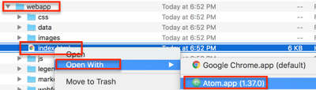


  - As changes are made in the following steps, use command + S or File>Save to save edits.
  - Periodically refresh the browser window with the map that is open to see the changes.
  - If the for any reason the map disappears, troubleshoot the code in index.html file by using command + z to undo any previous changes (command + shift + z is redo). Check to see: was a colon or curly bracket accidentally deleted? If a variable was changed, were all variable names in the file updated and spelled correctly?


5. Within the head tags (`<head>`), delete line 6, or the line which begins `meta name="viewport"...`.

  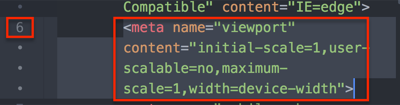

5. Copy and paste all of the following lines of code in its place or anywhere in the head `<head>` above the style tag `<style>`. Leaflet is meant to create mobile and web responsive maps, but these will help even more.

```js
<!-- Mobile meta tags to go in head-->
<meta name="HandheldFriendly" content="True">
<meta name="viewport" content="width=device-width, initial-scale=1.0, maximum-scale=1.0, user-scalable=no" />
<meta name="MobileOptimized" content="320"/>
<meta name="apple-mobile-web-app-capable" content="yes">
<meta http-equiv="cleartype" content="on">
```

  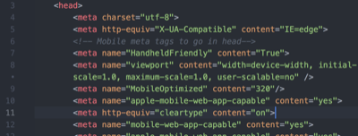

6. In the style (`<style>`) section of the head, paste the following code in **line 25**, or after the closed curly bracket. **Note**: the line could be different if you did not paste the code from the previous step exactly as shown, so just look for the line directly above the closed style tag `</style>`. This code sets a minimum width and height for the map popups and adds scrolling capabilities. Change the min-width and min-height to meet your needs.

```js
.leaflet-popup-content {
min-width: 200px;
min-height: 100px;
overflow-y: scroll;
}
```
  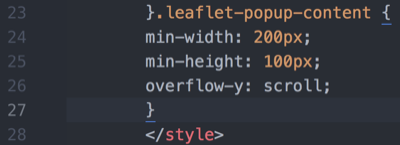

8. (Optional) Use command + F to find `marker`.

  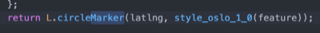

9. (Optional) Change `L.circleMarker` to `L.marker` to use the default Leaflet balloon markers instead of the one exported from QGIS. No need to delete any of the function `style_wf_1_0`, Leaflet will now ignore it.

10. (Optional steps 10-14) Change the basemap to the Google Earth and Streets hybrid basemap.
**Note**: It is possible to use Google Earth, Streets, or Hybrid from the start if QuickMapServices is configured with the [open GIS Lab tutorial](https://opengislab.com/blog/2018/4/15/add-basemaps-in-qgis-30).

11. Use command + F to find `var layer_OSMStandard_0`. This text may vary if you used a different basemap from the start.

12.  Delete the lines of code that are as follows:

```    js    
var layer_OSMStandard_0 = L.tileLayer('http://tile.openstreetmap.org/{z}/{x}/{y}.png', {
            opacity: 1.0,
            attribution: '<a href="https://www.openstreetmap.org/copyright">© OpenStreetMap contributors, CC-BY-SA</a>',
        });
        layer_OSMStandard_0;
```
13. Replace the code with the following:

``` js
var googleHybrid = L.tileLayer('https://{s}.google.com/vt/lyrs=s,h&x={x}&y={y}&z={z}',{
    maxZoom: 20,
    opacity: 1.0,
    subdomains:['mt0','mt1','mt2','mt3']
  });

googleHybrid;
```
14. Do a find and replace (command + F) for anything else that remains as `layer_OSMStandard_0` and replace it with `googleHybrid`

  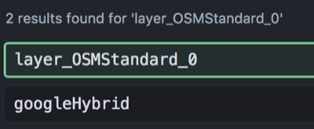

15. **Make your map secure. NOT OPTIONAL**: Open **find and replace** (command + F) to find all instances of **http:** web addresses and replace it with **https:**. Only do this with web addresses and **NOT** any http instances within a variable name or tag). This is necessary so that the final map does not create an insecure connection on websites. If this is not done, the website the map is embedded will appear as insecure.

  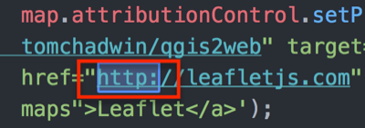

  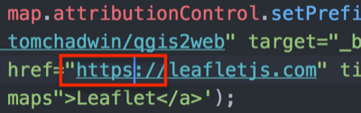


16. (Optional) Edit the legend to reflect the changes made such as the new basemap name and to remove the old marker image.

14. Use command + F to find the line that begins with `L.control.layers`.

  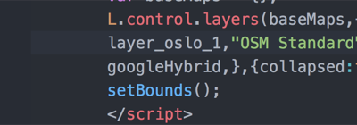


15. Some further changes that can be made:
  - If the places marker was changed, delete the image path that displays the old icon. You can add a new marker image by going into the webapp folder directory and adding it to the image folder.
  - Capitalize or change the name of the layer.
  - If the Google Hybrid basemap was used, replace the OSM Standard name in quotations with something like Google basemap


  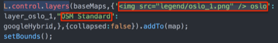


  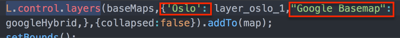

16. Make sure to continue to refresh the map in the browser to check the updates. Do the changes appear? If the map is not appearing at all, try to troubleshoot the code in the index.html file:
  - Was a colon or curly bracket accidentally deleted?
  - Were all variable names changed if choosing a new basemap?
<a id="push"></a>
## Push changes to GitHub
1. Open GitHub Desktop.

2. From the top left, make sure the current repository is the one with all of the data and Leaflet files.

  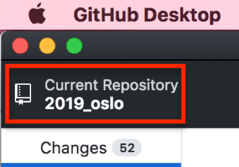

3. At the bottom, provide at least a summary for the changes and a description if desired, and click **Commit to master**.

  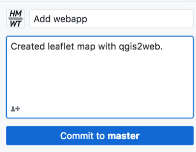

4. In the top right, click **Push origin**.

  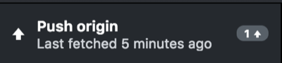
<a id="web"></a>
## Integrating with a website
The simplest way to embed the Leaflet map into a website is with an iframe. This may or may not be possible depending on the content management system being used. If you do not have a website, try creating a [Jekyll blog](https://jekyllrb.com/) that integrates with Github Pages. **Note**: This has not been tested by the tutorial author, but there is a [good Jekyll tutorial](https://devblast.com/b/create-a-static-websiteblog-with-jekyll-and-github-pages).

As of May 2019, iframe html tags `<iframe>` do not seem to be compatible with the most recent version of free, personal instances of WordPress. The best reason I could find was "due to security reasons."

Iframe html tags (e.g., `<iframe src=" ">`) may work with other content management systems and some older versions and instances of WordPress.

If you want to integrate the exported qgis2web map with a content management system that does not allow the iframe html tags or you do not currently have access to one there are a few ways to do it:

1. A **WordPress business plan** to access the [iframe plugin](https://wordpress.org/plugins/iframe/).
2. A **hosting service** that allows you to upload html pages in the content management system's source code, but this may still require some use of an iframe. This has not been tested successfully by the tutorial author, but it is known to be possible.
3. Create a link on a website you do have admin access to and link out to the gh-pages from the website. Work with the **index.html** file from qgis2web to start adding your own text and html to create a functional page or at least linking back to the original website. For example, the [WIDH visitor map](https://taylorhixson.github.io/WIDHmap/webapp/).

### Using the iframe html tag
This option may work with some content management systems, self-hosted websites, or older versions of WordPress.

1. Create a new page or post in the content management system. This example uses WordPress.

2.  Using the **classic editor**, choose **Text** instead of Visual.

3. Use the html iframe tag: `<iframe src=" " width=" " height=" "></iframe>`

4. Between the **iframe src= quotation marks**, paste the link to the **GitHub Pages** (gh-pages branch) for the project repository. It should look like https://YourGitHubAccount.github.io/repoName/webapp.

5. Between the width and height quotations, set the width and height of the map. For example, the final html might look like: `<iframe src="https://taylorhixson.github.io/WF/webapp" width="100%" height="400"></iframe>`. For width=, the 100% indicates stretching to fill the page width. It is also possible to set the width to a static number such as `width="800"`.

6. Click Preview to check out how it appears.

### Map text description

Maps are great! However, they may not be accessible to all users for reasons ranging from low-internet connectivity, incompatibility with a screenreader and/or keyboard-only navigation, vision impairment, and neurological differences.

Wherever the map is hosted, include a thorough text description. It is even possible to do add a text description within the index.html with basic html knowledge! Drafting the text descriptions in a spreadsheet from the start helps with the text description process because it makes it easy to directly copy text into the post editor. If the places were not listed in any particular order, make an effort to arrange the text descriptions in a way that will make narrative sense.

For example, if the map is of places, make an effort to provide a narrative or list that describes the places in the order they were visited. A thorough text description aims to give an equivalent experience to all users.
<a id="bonus"></a>
## Bonus materials on image processing
### Reformat images
The images I downloaded from the database for this workshop came in PDF format. For web viewing a thumbnail within the map popups, I thought a .png file was more appropriate. To reformat images use the following commands. These instructions are for Mac. The commands may or may not be compatible with other operating systems.

1.  **Copy** photos into a new folder in the git repository for this project. Make sure to **COPY** the images or have a backup of the original in case any errors occur.

2. **Skip to step 4** if you already know how to open and navigate within Terminal.
Open **Terminal**. If you are not sure where Terminal is, type Terminal into Mac's spotlight.

  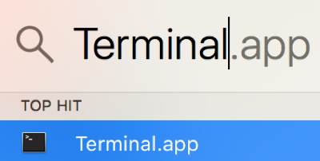

3. Navigate to the git repository folder with the images using the command `cd` (change directory). For example, use a relative file path like:

  ```
  cd ~/git/WF/images
  ```
  - If you are uncertain of the relative path or how to use it, use the `cd` (change directory) command through each subfolder to get to the images directory:

  ```
  cd git
  cd WF
  cd images
  ```

  4. Once in the directory, to batch reformat all the **files** into **PNGs** use the following command in Terminal: `for i in *; do sips -s format png $i --out $i.png; done`

  The above will reformat all files in the directory, so if you have varied types in the folder such as PDFs and TIFFs that you want to turn into PNGs, this _should_ still work.  

  Alternatively, reformat a single image using the following: `sips -s format png 1873.pdf --out 1873.png`

  **Note**: replace the input and output file names and file types with your own.  

### Resize images
These instructions are for Mac. The commands may or may not be compatible with other operating systems.

1. **Copy** photos into a new git repository folder titled images_small. Make sure to **COPY** the images or have a backup because these images will be resized.

2. (Optional) Rename the photos to something simpler or more systematic to make it easier to link them with the corresponding places in a later step.

3. **Skip to step 4** if you already know how to open and navigate within Terminal.
Open **Terminal**. If you are not sure where Terminal is, type Terminal into Mac's spotlight.

  

4. Change the directory using the command `cd` (change directory) to the git repository with the images. For example, use a relative file path like:

  ```
  cd git/WF/images
  ```
  - If you are uncertain of the relative path or how to use it, use the `cd` (change directory) command through each subfolder to get to the images directory:

  ```
  cd git
  cd WF
  cd images
  ```

5. Once Terminal shows that it is in the correct directory for the images for this project, use the following code to resize **all images to 300 pixels**, or the desired size:

  ```
  sips -Z 300 *.jpg
  ```
  - In the above code the **300 is the pixel width**--the height is auto-scaled. I do not suggest using anything larger than 300 pixels in the leaflet popup. These maps are not exactly the best platform for showcasing high-quality images. Include a link to a high-quality image if you would like.
  - The * (asterisk) represents choosing **all files** in the directory with the file type **.jpg.**
  - If your files are **not .jpg**, change it to **.tiff, .png, etc.**
  - The code above is **case sensitive.** Meaning, sometimes I need to run this **twice** because the file type of some images are **.JPG** and not **.jpg**.

### Create html image links
Format a column in html so that the photo will show up in the map popup. If you resized the image and want to link back to the original or larger format, create to columns: one with the image link to the large format one, and one with the html formatted image link to the resized image as shown how to format below.
1. Go to [GitHub.com](https://github.com), and go to the project repository.

2. Click the **images** folder. This assumes there is a folder called images in the repository where images are saved.

3. Click on an individual image link in the folder.

4. Right click the image, and choose **Copy Image Address**.

  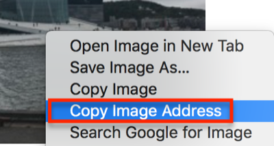

5. Open the spreadsheet with the place names and descriptions from the **List places... section**.

6. Paste the image link into an empty column in the appropriate row where the image depicts the place listed and described. If using a new spreadsheet, place it  **A1**.

  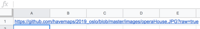

7. Keep copying and pasting image addresses next to any place with a corresponding image for all remaining images.
  - **Note**: There are many ways to get the image links into the spreadsheet. For example, you can also copy and paste a single image link down the spreadsheet and change just the image name in the link. If there are more than 20 images, finding an automated way to capture addresses may be helpful.


8. In an empty cell in the rows with images, **create alt text** to be read by screen readers or to display when the image does not appear. Alt text should be descriptive of the image **not** the experience.

  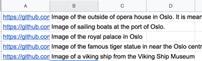

9. In the first empty cell in the next empty column type `=CONCATENATE` to activate the Concatenate formula.

10. Within the Concatenate formula parentheses () type: ``""``. In the formula the plus sign (+) acts as a placeholder for quotation marks needed in the html. Quotations may or may not work with the Concatenate formula in your spreadsheet software, but it definitely does not work in Google Sheets. Additionally, your columns (e.g., A1, B1) may be different depending on where links and alt text are placed.

11. Copy this formula down the column or into any cell that has an image and alt text.

12. Copy the column and **paste as values** in the next empty column. In Google Sheets, use **command + shift + v** to paste as values, or right click/control click the first empty cell and choose Paste Special>Paste Values Only.

13. Use **find and replace** to replace the **+**, or special character used, as a placeholder with a quotation mark.
  - Highlight the column where the formula was pasted as **values only**. This will make sure only this range is searched for find and replace.
  - Press command or ctrl + F to open **find and replace** in Google Sheets.
  - In Google Sheets, press the three stacked dots at the right of the window for more options.
  - Type **+** in Find and **"** in Replace with. Select replace all. Then, press Done.

  

  

14. **Delete** the column with the Concatenate formula, NOT the column with the final image link.

14. Now, there are a few options for how to integrate the image links:
  - **Concatenate** the Description column and the column with the final image links. If doing this, add a html manual line break `<br>` in the concatenate formula. This will NOT show the line break immediately, but the break **should** appear in the final map.
  - In the column with the final image links, add the column title **Image**.

[Return to top](#top)
